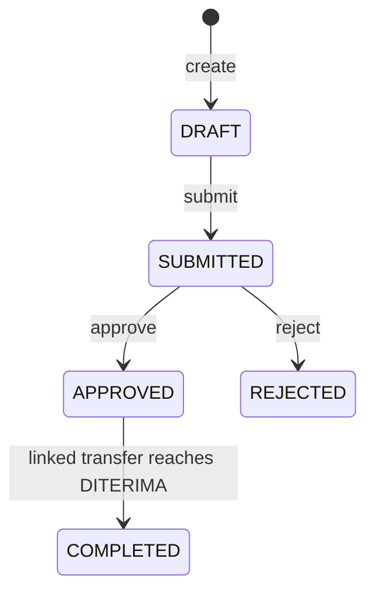
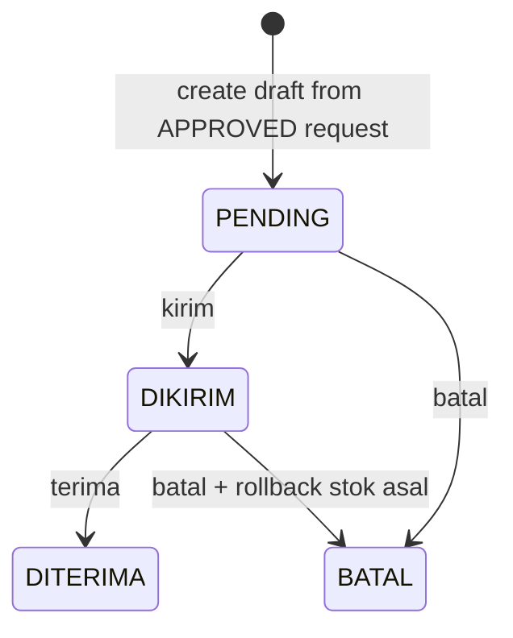

# Dokumentasi Teknis Menyeluruh Backend dan Deep Dive WMS Gudang

Tanggal audit: 2026-04-26  
Workspace: backend-js

## 1. Tujuan Dokumen

Dokumen ini dibuat untuk dua tujuan sekaligus:

1. Memberi gambaran menyeluruh tentang logika backend aplikasi (lintas semua domain besar).
2. Menjelaskan secara sangat detail struktur logika fitur Gudang/WMS dari awal sampai akhir, berdasarkan implementasi kode yang sedang aktif.

Dokumen ini menitikberatkan pada source of truth di layer route, controller, service, model, validator, dan test integration.

---

## 2. Ringkasan Arsitektur Backend Secara Menyeluruh

### 2.1 Pola Struktur Proyek

Backend ini menerapkan pola berlapis yang konsisten:

- `routes/` sebagai pintu endpoint dan middleware auth/permission.
- `controllers/` untuk orkestrasi request-response.
- `services/` sebagai pusat business logic.
- `models/` untuk schema, enum, relasi, index.
- `validators/` untuk validasi payload (custom + Mongoose).
- `middleware/` untuk auth, RBAC/permission, error handling.
- `config/` untuk database, redis, env.

Jumlah file inti di 5 layer utama (controller, service, model, route, validator) berada di sekitar 196 file, sehingga arsitektur masuk kategori enterprise modular monolith.

### 2.2 Request Lifecycle

Urutan lifecycle request secara umum:

1. Request masuk ke Express app (`app.js`).
2. Melewati middleware global: helmet, cors, json parser, urlencoded parser, cookie parser.
3. Masuk ke auto-loader route (`routes/index.js`) dan dimount ke prefix `/api`.
4. Masuk ke middleware auth (`authPengguna`/`authAkun`) dan permission guard jika route menggunakannya.
5. Controller menerima request, menempelkan konteks tenant/pengguna ke payload.
6. Controller memanggil service.
7. Service menjalankan validasi bisnis, query Mongoose, update cache Redis, dan side effect lintas model.
8. Response dikembalikan.
9. Jika error, diproses oleh centralized error handler (`middleware/errorHandler.js`).

### 2.3 Auto Mounting Route

Semua file route dimount otomatis oleh nama file route:

- `permintaanStokRoute.js` -> `/api/permintaanstok`
- `transferStokRoute.js` -> `/api/transferstok`
- `jurnalStokRoute.js` -> `/api/jurnalstok`

Catatan penting:

- Nama endpoint real di runtime mengikuti pola lowercase nama file tanpa suffix `Route`/`Routes`.
- Ini berbeda dengan beberapa dokumen lama yang memakai style dashed (`permintaan-stok`, `transfer-stok`).

### 2.4 Multi-Tenant Enforcement

Hampir semua model memiliki `tenantID` dan service umumnya memfilter by `tenantID`. Ini adalah fondasi isolasi data tenant. Secara umum implementasi multi-tenant sudah konsisten, terutama pada modul operasional utama.

### 2.5 Domain Besar di Backend

Secara menyeluruh backend ini mencakup domain berikut:

1. IAM/Auth/Tenant
2. Master Data Produk
3. POS (Penjualan + Pembayaran)
4. WMS Gudang
5. Booking & Aset
6. Keuangan & Laporan
7. SDM

Ringkasan domain non-WMS (supaya konteks lengkap):

- IAM: dual auth (`Akun` dan `Pengguna`) + role-permission granular.
- POS: transaksi penjualan, diskon, pajak, pembayaran, sinkron status bayar.
- Booking: sesi booking terkait aset dan transaksi penjualan.
- Laporan: agregasi harian dan bulanan.
- SDM: absensi, izin cuti, kontrak kompensasi, posisi.

---

## 3. Batasan dan Ruang Lingkup WMS Gudang

Di kode saat ini, fitur Gudang/WMS tersebar pada modul:

1. `Location`
2. `BahanBaku`
3. `Inventory`
4. `PermintaanStok`
5. `TransferStok`
6. `PembelianStok`
7. `JurnalStok`
8. `DashboardGudang`

Modul `JurnalTransfer` ada, tetapi implementasi modelnya saat ini mengarah ke transfer kas (`kasSumberID`, `kasTujuanID`) dan bukan mutasi stok bahan baku.

---

## 4. Data Model WMS dan Relasi Inti

## 4.1 Location

Tujuan:

- Master lokasi fisik (Gudang/Outlet).

Field kunci:

- `nama`
- `tipe` enum: `Outlet`, `Gudang`
- `alamat`
- `tenantID`

Peran dalam WMS:

- Menjadi origin (`dariLocationID`) dan destination (`keLocationID`) pada request/transfer.

## 4.2 BahanBaku

Tujuan:

- Master item stok bahan baku.

Field kunci:

- `namaBahan`
- `satuan`
- `tenantID`

Peran dalam WMS:

- Referensi item pada inventory/request/transfer/jurnal stok.

## 4.3 Inventory

Tujuan:

- Menyimpan saldo stok per `bahanBaku` per `location`.

Field kunci:

- `bahanBakuID`
- `locationID`
- `stok`
- `stokMinimum`
- `tenantID`

Index penting:

- Unique compound `(locationID, bahanBakuID)` agar satu bahan di satu lokasi hanya punya satu record saldo.

## 4.4 PermintaanStok

Tujuan:

- Dokumen kebutuhan barang dari lokasi tujuan ke lokasi asal.

Field kunci:

- `nomorRequest`
- `dariLocationID`
- `keLocationID`
- `items[]` dengan `bahanBakuID`, `jumlah`, `satuan`
- `status` enum: `DRAFT`, `SUBMITTED`, `APPROVED`, `REJECTED`, `COMPLETED`
- `transferStokID` (relasi ke surat jalan)
- `dimintaOleh`, `disetujuiOleh`

## 4.5 TransferStok

Tujuan:

- Surat jalan pemindahan stok antar lokasi.

Field kunci:

- `nomorTransfer`
- `permintaanStokID` (opsional tapi pada implementasi create wajib disupply)
- `dariLocationID`
- `keLocationID`
- `items[]`: `bahanBakuID`, `qtyKirim`, `qtyTerima`, `catatanItem`
- `status` enum: `PENDING`, `DIKIRIM`, `DITERIMA`, `BATAL`
- `tanggalKirim`, `tanggalTerima`
- `pengirimID`, `penerimaID`
- `tenantID`

## 4.6 JurnalStok

Tujuan:

- Audit log mutasi stok.

Field kunci:

- `bahanBakuID`
- `locationID`
- `tipeKoreksi` enum: `Masuk`, `Keluar`
- `alasan` enum: `Stok Opname`, `Rusak/Hilang`, `Transfer Gudang`, `Lainnya`
- `jumlah`
- `tanggal`
- `dicatatOleh`
- `tenantID`

## 4.7 PembelianStok

Tujuan:

- Mencatat pembelian bahan baku dari supplier.

Field kunci:

- `tanggal`
- `akunKasID`
- `supplier`
- `items[]`: `bahanBakuID`, `jumlah`, `hargaBeli`, `subtotal`
- `totalBiaya`
- `nomorFaktur`
- `dicatatOleh`
- `tenantID`

Catatan implementasi saat ini:

- Create pembelian stok belum otomatis menambah saldo `Inventory`.

## 4.8 DashboardGudang

Tujuan:

- Ringkasan indikator gudang/outlet:
  - jumlah permintaan per status
  - jumlah transfer per status
  - jumlah stok kritis
  - jurnal mutasi terbaru

---

## 5. Matriks Endpoint WMS di Runtime (Implementasi Aktual)

## 5.1 Location (`/api/location`)

Endpoints:

- `POST /`
- `GET /`
- `GET /:id`
- `PUT /:id`
- `DELETE /:id`

Guard:

- Wajib `authPengguna`.
- Belum ada `checkPermission` di route ini.

## 5.2 Inventory (`/api/inventory`)

Endpoints:

- `POST /` -> create inventory
- `GET /` -> list inventory (`checkPermission: read-inventory`)
- `GET /:id` -> detail (`checkPermission: read-inventory`)
- `PUT /:id` -> update inventory
- `DELETE /:id` -> delete inventory
- `POST /:id/opname` -> opname (`checkPermission: opname-inventory`)
- `PATCH /:id/minimum-stok` -> update threshold (`checkPermission: update-inventory-minimum`)
- `POST /process-sale` -> potong stok dari resep penjualan

Catatan:

- Beberapa endpoint write (`POST /`, `PUT /:id`, `DELETE /:id`, `POST /process-sale`) belum diberi guard permission eksplisit di route.

## 5.3 Permintaan Stok (`/api/permintaanstok`)

Endpoints:

- `GET /` (`read-permintaan-stok`)
- `POST /` (`create-permintaan-stok`)
- `PUT /:id` (`update-permintaan-stok`)
- `PATCH /:id/submit` (`update-permintaan-stok`)
- `PATCH /:id/approve` (`approve-permintaan-stok`)
- `PATCH /:id/reject` (`reject-permintaan-stok`)

## 5.4 Transfer Stok (`/api/transferstok`)

Endpoints:

- `POST /` (`create-transfer-stok`)
- `GET /` (`read-transfer-stok`)
- `GET /:id` (`read-transfer-stok`)
- `PUT /:id` (`create-transfer-stok`) untuk update draft
- `DELETE /:id` (`cancel-transfer-stok`) untuk delete draft
- `PATCH /:id/kirim` (`approve-transfer-stok`)
- `PATCH /:id/terima` (`receive-transfer-stok`)
- `PATCH /:id/batal` (`cancel-transfer-stok`)

## 5.5 Pembelian Stok (`/api/pembelianstok`)

Endpoints:

- `POST /`
- `GET /`
- `GET /:id`
- `PUT /:id`
- `DELETE /:id`

Guard:

- Route menggunakan `authPengguna`.
- Validasi izin dilakukan di controller (`kelola-pembelian-stok`).

## 5.6 Jurnal Stok (`/api/jurnalstok`)

Endpoints:

- `POST /` (`kelola-jurnal-stok`)
- `GET /` (`read-jurnal-stok`)
- `GET /:id` (`read-jurnal-stok`)
- `PUT /:id` (`kelola-jurnal-stok`)
- `DELETE /:id` (`kelola-jurnal-stok`)

## 5.7 Jurnal Transfer (`/api/jurnaltransfer`)

Endpoints:

- `POST /`
- `GET /`
- `GET /:id`
- `PUT /:id`
- `DELETE /:id`

Catatan:

- Route tidak memasang `checkPermission`, tapi controller melakukan check internal.
- Model jurnal transfer saat ini berisi transfer akun kas, bukan mutasi stok.

## 5.8 Dashboard (`/api/dashboard`)

Endpoints:

- `GET /gudang` (`read-dashboard-gudang`)
- `GET /outlet` (`read-dashboard-outlet`)

---

## 6. State Machine WMS (Implementasi Aktual)

## 6.1 State Machine PermintaanStok

Aturan penting:

1. `submit` hanya bisa dari `DRAFT`.
2. `approve` hanya bisa dari `SUBMITTED`.
3. `reject` hanya bisa dari `SUBMITTED`.
4. `COMPLETED` dipicu oleh proses `TransferStok` saat status transfer menjadi `DITERIMA` (jika transfer terkait permintaan).

## 6.2 State Machine TransferStok

Aturan penting:

1. Dari `PENDING` hanya valid ke `DIKIRIM` atau `BATAL`.
2. Dari `DIKIRIM` hanya valid ke `DITERIMA` atau `BATAL`.
3. Dari `DITERIMA`/`BATAL` tidak bisa diubah lagi.

---

## 7. Alur End-to-End WMS Dari Awal Sampai Akhir

Bagian ini adalah inti dokumen.

## 7.1 Tahap 0 - Persiapan Master Data

Urutan inisialisasi ideal sebelum transaksi gudang:

1. Tenant aktif dan user login (`authPengguna`).
2. Permission role sudah disiapkan (`read-inventory`, `create-permintaan-stok`, `approve-transfer-stok`, dst).
3. Lokasi dibuat (`Gudang`, `Outlet`) di tenant yang sama.
4. Bahan baku master dibuat.
5. Saldo inventory awal diisi per lokasi (`Inventory`).

Tanpa tahap ini, proses request/transfer akan gagal karena relasi field (`bahanBakuID`, `locationID`) tidak valid atau stok asal tidak cukup.

## 7.2 Tahap 1 - Pembuatan Permintaan Stok (Draft)

Aktor umum:

- Outlet/staff yang memiliki permission `create-permintaan-stok`.

Urutan teknis:

1. Client memanggil `POST /api/permintaanstok`.
2. Controller menempelkan `tenantID`, `dimintaOleh`, dan status awal `DRAFT`.
3. Service `create` membuat `nomorRequest` otomatis jika belum ada:
   - format: `REQ/YYYYMM/####`
4. Data disimpan ke `PermintaanStok`.
5. Cache list permintaan tenant dihapus.

Output:

- Dokumen permintaan status `DRAFT`.
- Belum ada mutasi stok.

## 7.3 Tahap 2 - Edit Draft dan Submit

### Edit Draft

Endpoint:

- `PUT /api/permintaanstok/:id`

Aturan service saat ini:

- Tidak boleh edit jika status: `SUBMITTED`, `COMPLETED`, `REJECTED`.
- Artinya status `DRAFT` boleh edit.
- Perlu perhatian: status `APPROVED` tidak masuk daftar terlarang ini, sehingga secara kode masih bisa terkena update endpoint ini jika permission route terpenuhi.

### Submit

Endpoint:

- `PATCH /api/permintaanstok/:id/submit`

Aturan:

1. Hanya valid jika status sekarang `DRAFT`.
2. Status berubah ke `SUBMITTED`.
3. Cache permintaan tenant dihapus.

Output:

- Dokumen siap di-approve/reject oleh role yang berwenang.

## 7.4 Tahap 3 - Approve atau Reject Permintaan

### Approve

Endpoint:

- `PATCH /api/permintaanstok/:id/approve`

Aturan:

1. Hanya valid untuk dokumen status `SUBMITTED`.
2. Status menjadi `APPROVED`.
3. `disetujuiOleh` dan `tanggalApprove` diset.
4. Cache permintaan dihapus.

Catatan penting implementasi saat ini:

- Approve tidak otomatis membuat TransferStok.
- Surat jalan dibuat manual melalui endpoint transfer dengan menyertakan `permintaanStokID`.

### Reject

Endpoint:

- `PATCH /api/permintaanstok/:id/reject`

Aturan:

1. Hanya valid untuk status `SUBMITTED`.
2. Status menjadi `REJECTED`.
3. Menyimpan catatan penolakan.
4. Cache dihapus.

Output:

- Permintaan berakhir tanpa mutasi stok.

## 7.5 Tahap 4 - Pembuatan Draft Transfer (Surat Jalan)

Endpoint:

- `POST /api/transferstok`

Prasyarat paling penting:

1. Wajib menyertakan `permintaanStokID` yang valid.
2. Permintaan terkait harus status `APPROVED`.
3. Permintaan terkait belum punya `transferStokID`.

Validasi inti di service:

1. `dariLocationID` dan `keLocationID` harus sesuai dengan dokumen permintaan jika di-supply.
2. Item transfer harus subset dari item permintaan.
3. `qtyKirim` tidak boleh melebihi `jumlah` yang diminta.
4. Stok asal di `Inventory` dicek sejak tahap draft (early stock validation).

Pembuatan nomor transfer:

- Jika tidak dikirim, service generate: `SJ-[nomorRequest]-[suffix unik waktu]`.

Setelah transfer berhasil dibuat:

1. `transferStokID` ditulis balik ke dokumen permintaan.
2. Status transfer default `PENDING`.
3. Stok belum berkurang pada tahap ini.

## 7.6 Tahap 5 - Kirim Barang (`PENDING -> DIKIRIM`)

Endpoint:

- `PATCH /api/transferstok/:id/kirim`

Validasi status transisi:

1. Hanya transfer `PENDING` yang boleh jadi `DIKIRIM`.

Mutasi stok saat kirim:

Untuk setiap item transfer:

1. Service menjalankan `findOneAndUpdate` di Inventory asal dengan guard `stok >= qtyKirim`.
2. Jika stok tidak cukup, proses gagal.
3. Jika sukses, stok asal dikurangi (`-qtyKirim`).
4. Service membuat `JurnalStok` tipe `Keluar`, alasan `Transfer Gudang`, dengan keterangan nomor transfer.

Update metadata transfer:

- `status = DIKIRIM`
- `tanggalKirim` diset
- `pengirimID` diset

## 7.7 Tahap 6 - Terima Barang (`DIKIRIM -> DITERIMA`)

Endpoint:

- `PATCH /api/transferstok/:id/terima`

Validasi status transisi:

1. Hanya transfer `DIKIRIM` yang boleh diterima.

Proses mutasi:

Untuk setiap item:

1. `receivedQty` dihitung dari `qtyTerima` jika ada, fallback ke `qtyKirim`.
2. Inventory tujuan di-increment sebesar `receivedQty`.
3. Jika inventory tujuan belum ada, dibuat otomatis (`upsert`).
4. Buat `JurnalStok` tipe `Masuk`, alasan `Transfer Gudang`.

Update metadata transfer:

- `status = DITERIMA`
- `tanggalTerima` diset
- `penerimaID` diset

Jembatan ke permintaan stok:

- Jika transfer punya `permintaanStokID`, maka dokumen permintaan terkait otomatis diubah ke `COMPLETED`.

## 7.8 Tahap 7 - Pembatalan Transfer

Endpoint:

- `PATCH /api/transferstok/:id/batal`

Skenario A: batalkan dari `PENDING`

- Status langsung menjadi `BATAL`.
- Tidak ada rollback stok karena stok belum sempat dipotong.

Skenario B: batalkan dari `DIKIRIM`

Untuk setiap item:

1. Tambahkan stok kembali ke inventory asal (`+qtyKirim`).
2. Buat `JurnalStok` tipe `Masuk` dengan alasan `Lainnya`, keterangan pembatalan transfer.

Lalu:

- Status transfer menjadi `BATAL`.

## 7.9 Tahap 8 - Monitoring Dashboard Gudang/Outlet

Endpoint:

- `GET /api/dashboard/gudang`
- `GET /api/dashboard/outlet`

Komponen ringkasan:

1. Jumlah permintaan per status penting.
2. Jumlah transfer per status penting.
3. Jumlah stok kritis (`stok <= stokMinimum`).
4. 5 jurnal stok terbaru.

Manfaat operasional:

- Membantu supervisor menentukan prioritas: approve request, kirim barang, atau lakukan restock bahan kritis.

---

## 8. Inventory Operations Detail

Bagian ini memperdalam logika inventaris yang sering dipakai lintas modul.

## 8.1 Listing Inventory

Endpoint:

- `GET /api/inventory`

Filter query:

- `locationID`
- `kategori`
- `search`

Detail logika:

1. Jika tanpa filter, service mencoba baca dari Redis key `inventory:list:{tenantID}`.
2. Query populate ke `bahanBakuID` dan `locationID`.
3. Jika filter kategori dipakai, service menggunakan `populate.match` lalu post-filter item null.
4. Jika search dipakai, service post-filter regex ke `namaBahan`.

## 8.2 Opname

Endpoint:

- `POST /api/inventory/:id/opname`

Alur:

1. Ambil stok lama.
2. Hitung delta = `fisikAktual - stokLama`.
3. Simpan stok fisik terbaru.
4. Catat jurnal:
   - `Masuk` jika delta positif
   - `Keluar` jika delta negatif
5. Invalidate cache list inventory.

## 8.3 Update Minimum Stok

Endpoint:

- `PATCH /api/inventory/:id/minimum-stok`

Aturan:

1. `stokMinimum` tidak boleh negatif.
2. Simpan nilai threshold per item per lokasi.
3. Invalidate cache list.

## 8.4 Process Sale Stock (Integrasi dengan Penjualan)

Endpoint:

- `POST /api/inventory/process-sale`

Input:

- `produkID`
- `qtyJual`
- `locationID`

Alur:

1. Validasi produk dan parameter.
2. Kurangi `Produk.stok` dulu.
3. Untuk setiap item resep produk:
   - hitung `totalButuh = jumlahResep * qtyJual`
   - kurangi inventory bahan di lokasi penjualan.
   - catat `JurnalStok` keluar.
4. Jika ada error di proses bahan, rollback `Produk.stok`.

Catatan operasional:

- Endpoint ini memotong inventory bahan baku per lokasi berdasarkan resep.
- Endpoint ini terpisah dari flow transfer antar lokasi.

---

## 9. Pembelian Stok dan Jurnal

## 9.1 PembelianStok

Fungsi utama saat ini:

- Mencatat invoice pembelian supplier dan total biaya.

Yang sudah ada:

1. Validasi payload pembelian.
2. Generate nomor faktur otomatis jika kosong.
3. Cache list/detail pembelian.

Yang belum otomatis:

- Tidak ada mutasi `Inventory` otomatis saat create pembelian.
- Tidak ada auto-create `JurnalStok` dari pembelian.

Implikasi:

- Jika tim ingin pembelian langsung menambah stok, perlu sinkronisasi tambahan di service ini.

## 9.2 JurnalStok Manual

Service `JurnalStok` punya mode CRUD manual dengan side effect ke inventory:

1. Create jurnal `Masuk/Keluar` otomatis menambah/mengurangi stok inventory.
2. Update jurnal akan reverse efek lama lalu apply efek baru.
3. Delete jurnal akan reverse efek mutasi jurnal tersebut.

Ini berguna untuk:

- koreksi administrasi
- perbaikan data mutasi
- audit trail

---

## 10. RBAC WMS (Permission Matrix Praktis)

Permission WMS utama yang disediakan seed:

1. `read-inventory`
2. `update-inventory-minimum`
3. `opname-inventory`
4. `read-permintaan-stok`
5. `create-permintaan-stok`
6. `update-permintaan-stok`
7. `approve-permintaan-stok`
8. `reject-permintaan-stok`
9. `read-transfer-stok`
10. `create-transfer-stok`
11. `approve-transfer-stok`
12. `receive-transfer-stok`
13. `cancel-transfer-stok`
14. `read-jurnal-stok`
15. `kelola-jurnal-stok`
16. `read-dashboard-gudang`
17. `read-dashboard-outlet`
18. `kelola-pembelian-stok`
19. `kelola-lokasi`

Contoh role operasional (berdasarkan pola test integration):

1. Staff Outlet / Manajer Outlet
   - boleh request stok
   - boleh lihat inventory terbatas
   - boleh receive transfer
   - tidak boleh approve/reject request
   - tidak boleh kirim/batal transfer

2. Manager/Admin Gudang
   - boleh approve/reject request
   - boleh create transfer
   - boleh kirim dan batal transfer
   - boleh lihat dashboard gudang

3. Owner
   - pada praktik umumnya full access tenant

---

## 11. Redis Caching WMS

WMS memakai Redis untuk mengurangi query berulang pada list/detail tertentu.

Contoh key penting:

1. Inventory:
   - `inventory:list:{tenantID}`
   - `inventory:detail:{id}`
2. Location:
   - `location:list:{tenantID}`
   - `location:detail:{id}`
3. Permintaan:
   - `permintaanStok:list:{tenantID}`
4. Pembelian:
   - `pembelian:list:{tenantID}`
   - `pembelian:detail:{id}`
5. Jurnal stok:
   - `jurnalstok:list:{tenantID}`
   - `jurnalstok:detail:{id}`

Pola invalidasi:

1. Setelah create/update/delete.
2. Setelah transisi status yang mengubah data list.
3. Setelah mutasi stok yang berdampak pada inventory.

---

## 12. Integrasi WMS dengan Modul Lain

## 12.1 Integrasi ke Penjualan

Ada dua jalur yang perlu dipahami:

1. Jalur penjualan utama (`PenjualanService`) mengurangi `Produk.stok` saat finalisasi.
2. Jalur endpoint inventory process-sale mengurangi `Inventory` bahan baku berdasarkan resep.

Implikasi:

- Secara desain operasional, WMS harus memperjelas kapan POS memotong porsi produk dan kapan memotong bahan baku lokasi.

## 12.2 Integrasi ke Dashboard

Dashboard gudang/outlet mengambil data agregat dari:

- PermintaanStok
- TransferStok
- Inventory
- JurnalStok

## 12.3 Integrasi ke Laporan Keuangan

Laporan harian/bulanan berada di domain keuangan, tetapi secara bisnis WMS mempengaruhi beban/COGS. Pada implementasi saat ini agregasi WMS ke laporan tidak otomatis lengkap di semua aspek HPP.

---

## 13. Skenario Operasional Lengkap (Praktik Harian)

## 13.1 Skenario Happy Path Lengkap

1. Outlet membuat `DRAFT` permintaan.
2. Outlet submit jadi `SUBMITTED`.
3. Admin gudang approve jadi `APPROVED`.
4. Staff gudang buat transfer dari request approved jadi `PENDING`.
5. Gudang kirim transfer jadi `DIKIRIM`:
   - stok asal berkurang
   - jurnal keluar tercatat
6. Outlet terima transfer jadi `DITERIMA`:
   - stok tujuan bertambah
   - jurnal masuk tercatat
   - permintaan otomatis `COMPLETED`

## 13.2 Skenario Reject

1. Permintaan `SUBMITTED` direject.
2. Status jadi `REJECTED`.
3. Tidak ada transfer.
4. Tidak ada mutasi inventory.

## 13.3 Skenario Batal Setelah Kirim

1. Transfer sudah `DIKIRIM`.
2. Dibatalkan menjadi `BATAL`.
3. Sistem rollback stok ke lokasi asal.
4. Sistem catat jurnal masuk pembatalan.

## 13.4 Skenario Stok Tidak Cukup Saat Draft

1. User buat transfer dengan qty > stok asal.
2. Create transfer ditolak 400 oleh early stock validation.
3. Dokumen transfer tidak terbentuk.

## 13.5 Skenario Stok Berubah Saat Akan Kirim

1. Draft dibuat saat stok cukup.
2. Sebelum kirim, stok terpakai transaksi lain.
3. Saat kirim, guard `stok >= qtyKirim` gagal.
4. Request kirim ditolak.

---

## 14. Validasi yang Perlu Dipahami Tim

## 14.1 Validasi Model

Contoh:

1. `Inventory.stok` tidak boleh negatif.
2. `TransferStok.qtyKirim` minimal 1.
3. `PermintaanStok.status` hanya boleh enum resmi.
4. `JurnalStok.alasan` hanya enum resmi.

## 14.2 Validasi Service

Contoh:

1. Permintaan hanya bisa approve/reject dari `SUBMITTED`.
2. Transfer hanya bisa dibuat dari permintaan `APPROVED`.
3. Transfer tidak boleh double-link ke satu permintaan.
4. Qty kirim tidak boleh melebihi qty request.

## 14.3 Validasi Permission

1. Sebagian besar endpoint WMS sudah dilindungi `checkPermission` di route.
2. Beberapa endpoint write masih mengandalkan auth saja.
3. Beberapa controller memakai check izin internal dengan pola berbeda.

---

## 15. Hasil Verifikasi Test WMS

Test integration WMS utama yang diverifikasi:

1. `__tests__/integration/wmsWorkflow.test.js`
2. `__tests__/integration/permintaanStok.test.js`
3. `__tests__/integration/pushTransfer.test.js`
4. `__tests__/integration/manajerOutletRBA.test.js`

Hasil:

- 4 test suite passed.
- 15 test case passed.

Makna hasil:

1. Workflow inti request -> transfer -> receive berjalan sesuai implementasi service sekarang.
2. RBAC route guard pada skenario manajer outlet terverifikasi untuk hak dasar.
3. Early stock validation pada create transfer teruji.

---

## 16. Temuan Penting dari Audit Kode (Agar Tim Tidak Salah Asumsi)

Bagian ini penting karena beberapa dokumen lama tidak lagi identik dengan implementasi terbaru.

## 16.1 Perbedaan Endpoint Dokumen Lama vs Runtime

1. Runtime menggunakan `/api/permintaanstok`, bukan `/api/permintaan-stok`.
2. Runtime menggunakan `/api/transferstok`, bukan `/api/transfer-stok`.
3. Runtime memakai `PATCH` untuk `submit/approve/reject/kirim/terima/batal`.

## 16.2 Approve Permintaan Tidak Auto Create Transfer

Di implementasi aktif:

- Approve hanya ubah status ke `APPROVED`.
- Transfer harus dibuat manual via endpoint transfer.

## 16.3 JurnalTransfer Tidak Mencatat Selisih Barang

Model `JurnalTransfer` saat ini berorientasi transfer kas antar akun kas, bukan jurnal selisih barang transfer gudang.

## 16.4 Pembelian Stok Tidak Otomatis Tambah Inventory

Pembelian stok saat ini adalah pencatatan finansial-operasional pembelian, bukan auto mutasi saldo stok lokasi.

## 16.5 Potensi Inkonistensi Permission Check

Ada modul tertentu yang melakukan check izin internal dengan pendekatan ObjectId permission, sementara middleware auth pengguna umumnya membentuk daftar permission sebagai nama string. Ini perlu standardisasi agar perilaku izin tidak ambigu.

## 16.6 Operasi Multi-Step Belum Seluruhnya Bertransaksi DB

Beberapa flow mutasi multi-item (misalnya status update transfer) berjalan sekuensial tanpa transaction session MongoDB. Secara bisnis ini penting dicatat untuk hardening produksi.

---

## 17. Checklist Operasional untuk Tim Gudang

Checklist harian:

1. Pastikan role/permission user gudang dan outlet sudah benar.
2. Cek dashboard gudang untuk request `SUBMITTED` dan transfer `PENDING/DIKIRIM`.
3. Proses approval request sesuai prioritas kebutuhan outlet.
4. Saat membuat transfer, validasi item dan qty kirim.
5. Setelah kirim, monitor penerimaan outlet agar cepat `DITERIMA`.
6. Lakukan opname berkala dan pastikan jurnal tercatat.

Checklist audit mingguan:

1. Rekonsiliasi `Inventory` vs `JurnalStok`.
2. Cek transfer yang lama di status `DIKIRIM`.
3. Cek item stok kritis (`stok <= stokMinimum`).
4. Cek request berstatus `APPROVED` tapi belum dibuat transfer.

---

## 18. Urutan Belajar Kode WMS (Agar Cepat Paham)

Urutan baca file yang direkomendasikan untuk engineer baru:

1. `routes/permintaanStokRoute.js`
2. `controllers/permintaanStokController.js`
3. `services/permintaanStokService.js`
4. `models/permintaanStokModel.js`
5. `routes/transferStokRoute.js`
6. `controllers/transferStokController.js`
7. `services/transferStokService.js`
8. `models/transferStokModel.js`
9. `services/inventoryService.js`
10. `models/inventoryModel.js`
11. `services/jurnalStokService.js`
12. `models/jurnalStokModel.js`
13. `services/dashboardGudangService.js`
14. `__tests__/integration/wmsWorkflow.test.js`
15. `__tests__/integration/manajerOutletRBA.test.js`

Dengan urutan ini, engineer biasanya bisa memahami full flow WMS dari request awal sampai mutasi stok akhir dalam waktu paling singkat.

---

## 19. Penutup

Kesimpulan utama:

1. Struktur WMS di backend ini sudah cukup matang dengan state machine yang jelas untuk request dan transfer.
2. Implementasi mutasi stok inti berjalan di titik yang tepat: kirim (decrement asal), terima (increment tujuan), batal dari dikirim (rollback asal).
3. Integrasi jurnal stok sudah aktif sebagai audit trail.
4. Masih ada area penyempurnaan untuk standardisasi permission check, sinkronisasi dokumen lama, dan penguatan transaksi multi-step.

Untuk kebutuhan operasional harian, dokumen ini bisa dijadikan acuan utama memahami logika gudang dari awal sampai akhir.
