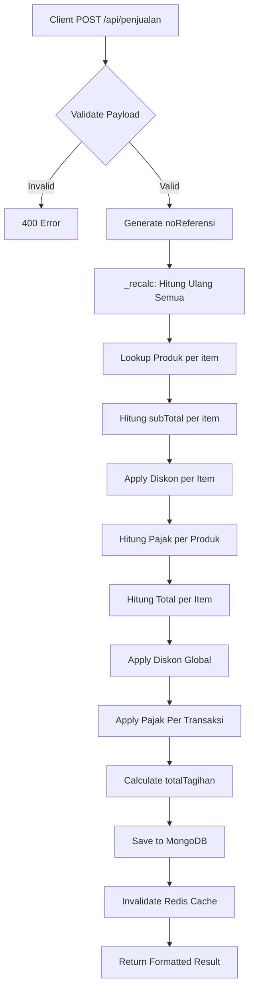
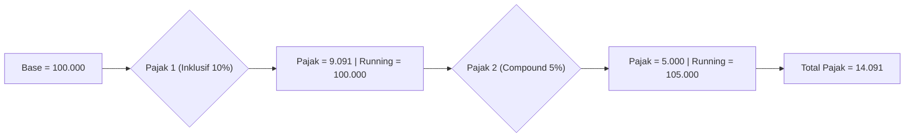
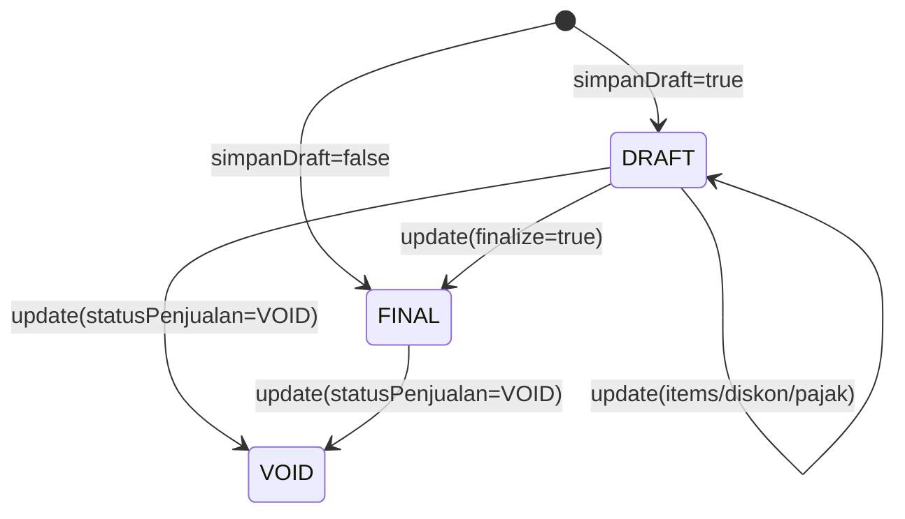
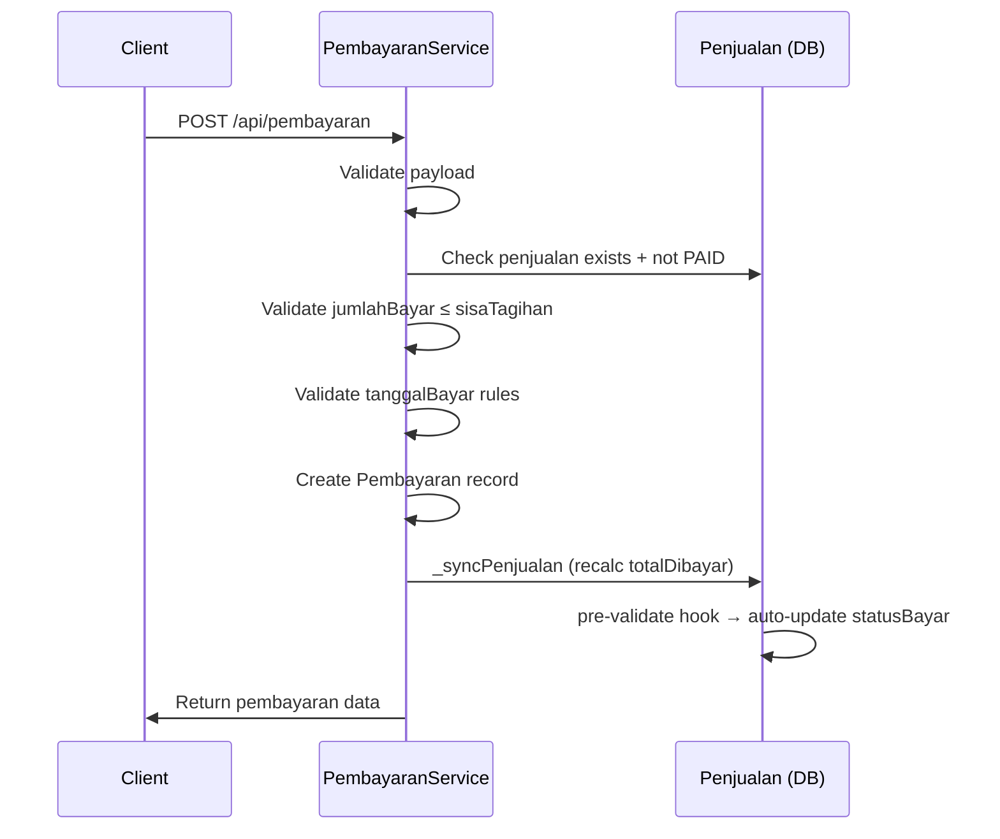

# 📋 Backend Invoice — Fitur Lengkap

> Dokumentasi komprehensif seluruh fitur Invoice di backend-js.
> Berdasarkan analisis langsung dari source code: [penjualanService.js](file:///C:/api_ajis/backend/backend-js/services/penjualanService.js) (750 baris), [pembayaranService.js](file:///C:/api_ajis/backend/backend-js/services/pembayaranService.js) (520 baris), model, controller, validator, dan route files.

---

## 🏗️ Arsitektur File

| Layer | File | Baris | Deskripsi |
|---|---|--:|---|
| **Route** | [penjualanRoute.js](file:///C:/api_ajis/backend/backend-js/routes/penjualanRoute.js) | 23 | REST endpoints penjualan |
| **Controller** | [penjualanController.js](file:///C:/api_ajis/backend/backend-js/controllers/penjualanController.js) | 141 | Request handler + tenant scoping |
| **Service** | [penjualanService.js](file:///C:/api_ajis/backend/backend-js/services/penjualanService.js) | 750 | Business logic inti |
| **Model** | [penjualanModel.js](file:///C:/api_ajis/backend/backend-js/models/penjualanModel.js) | 233 | Mongoose schema + pre-validate hook |
| **Validator** | [penjualanValidator.js](file:///C:/api_ajis/backend/backend-js/validators/penjualanValidator.js) | 168 | Payload validation (create + update) |
| **Route** | [pembayaranRoute.js](file:///C:/api_ajis/backend/backend-js/routes/pembayaranRoute.js) | 23 | REST endpoints pembayaran |
| **Controller** | [pembayaranController.js](file:///C:/api_ajis/backend/backend-js/controllers/pembayaranController.js) | — | Request handler pembayaran |
| **Service** | [pembayaranService.js](file:///C:/api_ajis/backend/backend-js/services/pembayaranService.js) | 520 | Business logic pembayaran |
| **Model** | [pembayaranModel.js](file:///C:/api_ajis/backend/backend-js/models/pembayaranModel.js) | 86 | Mongoose schema pembayaran |
| **Validator** | [pembayaranValidator.js](file:///C:/api_ajis/backend/backend-js/validators/pembayaranValidator.js) | — | Payload validation pembayaran |

---

## 📡 API Endpoints

### Penjualan (Invoice + POS)

| Method | Path | Handler | Deskripsi |
|---|---|---|---|
| `POST` | `/api/penjualan` | [create](file:///C:/File_Android/Belajar/produk_coba_coba/lib/services/pajak_service.dart#56-71) | Buat transaksi baru (Invoice/POS) |
| `GET` | `/api/penjualan` | [getAll](file:///C:/api_ajis/backend/backend-js/controllers/penjualanController.js#13-39) | Ambil semua transaksi (dengan filter) |
| `GET` | `/api/penjualan/:id` | [getById](file:///C:/api_ajis/backend/backend-js/controllers/penjualanController.js#40-59) | Ambil detail satu transaksi |
| `PUT` | `/api/penjualan/:id` | [update](file:///C:/api_ajis/backend/backend-js/services/penjualanService.js#599-725) | Update transaksi (DRAFT) / VOID |
| `DELETE` | `/api/penjualan/:id` | [delete](file:///C:/api_ajis/backend/backend-js/services/pembayaranService.js#490-518) | Hapus transaksi DRAFT |

### Pembayaran

| Method | Path | Handler | Deskripsi |
|---|---|---|---|
| `POST` | `/api/pembayaran` | [create](file:///C:/File_Android/Belajar/produk_coba_coba/lib/services/pajak_service.dart#56-71) | Catat pembayaran baru |
| `GET` | `/api/pembayaran` | [getAll](file:///C:/api_ajis/backend/backend-js/controllers/penjualanController.js#13-39) | Ambil semua pembayaran |
| `GET` | `/api/pembayaran/:id` | [getById](file:///C:/api_ajis/backend/backend-js/controllers/penjualanController.js#40-59) | Detail satu pembayaran |
| `PUT` | `/api/pembayaran/:id` | [update](file:///C:/api_ajis/backend/backend-js/services/penjualanService.js#599-725) | Update pembayaran |
| `DELETE` | `/api/pembayaran/:id` | [delete](file:///C:/api_ajis/backend/backend-js/services/pembayaranService.js#490-518) | Hapus pembayaran |

> [!NOTE]
> Semua endpoint dilindungi `authPengguna` middleware — JWT auth required.

---

## 1️⃣ Fitur: Create Penjualan (Invoice/POS)

### Flow Lengkap



### Payload Create

```json
{
  "pelangganID": "ObjectId",
  "jenisTransaksi": "INVOICE",      // "INVOICE" | "POS"
  "jenisPenjualan": "dine-in",      // "dine-in" | "takeaway" | "booking"
  "tanggalTransaksi": "2026-03-12",
  "jatuhTempo": "2026-04-12",       // opsional, khusus INVOICE
  "keterangan": "Catatan opsional",
  "simpanDraft": false,              // true = simpan sebagai DRAFT
  "noReferensi": "",                 // opsional, auto-generate jika kosong
  "itemPenjualan": [
    {
      "produkID": "ObjectId",
      "jumlah": 2,
      "hargaJual": 25000,            // opsional, fallback dari DB produk
      "namaProduk": "Nasi Goreng",   // opsional, fallback dari DB produk
      "diskonItem": ["diskonID1"]    // opsional, array diskon per-item
    }
  ],
  "diskonGlobal": ["diskonID2"],     // opsional, array diskon global
  "pajakTransaksi": ["pajakID1"]     // opsional, auto-detect dari tenant
}
```

### Auto-Generated No. Referensi

Format: `{PREFIX}/TKA/{YYYYMMDD}/{HHmmssSSS}`

| Jenis | Contoh |
|---|---|
| Invoice | `INV/TKA/20260312/143022001` |
| POS | `POS/TKA/20260312/143022001` |

---

## 2️⃣ Fitur: Perhitungan Otomatis ([_recalc](file:///C:/api_ajis/backend/backend-js/services/penjualanService.js#361-469))

Ini adalah **engine inti** — menghitung seluruh angka secara otomatis.

### Per Item

| Step | Kalkulasi | Sumber |
|---|---|---|
| 1. Lookup produk | Validasi `produkID` ada + milik tenant | `Produk.findOne()` |
| 2. Harga | `hargaJual` dari payload, fallback dari DB | `produkData.hargaJual` |
| 3. SubTotal | `jumlah × hargaJual` | Dihitung otomatis |
| 4. Diskon Item | Urutan bertahap: persen dulu (running base), lalu nominal | [_applyDiskonBerurutan()](file:///c:/api_ajis/backend/backend-js/services/penjualanService.js#211-272) |
| 5. Total (setelah diskon) | `subTotal - jumlahDiskon` | Floor = 0 |
| 6. Pajak per Produk | Dari API `pajakService.hitungPajakProduk()` | Per-produk assigned pajak |
| 7. Total Harga Item | `total + jumlahPajak` | `pajakCalc.grandTotal` |

### Diskon Berurutan ([_applyDiskonBerurutan](file:///c:/api_ajis/backend/backend-js/services/penjualanService.js#211-272))

```
Base = 100.000
→ Diskon 1: 10% → potong 10.000 → running = 90.000
→ Diskon 2: Rp 5.000 → potong 5.000 → running = 85.000
→ Total Diskon = 15.000
```

- Validasi: `diskonService.validateKombinasiDiskon()` — cek apakah bisa digabung
- Diskon yang: `status: "Aktif"`, `cakupan: "Item"` atau `"Global"`
- **Persen**: dihitung dari running base (compound)
- **Nominal**: langsung potong

### Per Transaksi

| Step | Kalkulasi |
|---|---|
| 1. Grand Total Item | Σ `item.totalharga` |
| 2. Diskon Global | [_applyDiskonBerurutan(grandTotal, diskonGlobalIDs, "Global")](file:///c:/api_ajis/backend/backend-js/services/penjualanService.js#211-272) |
| 3. Dasar Pajak Transaksi | `grandTotal - diskonGlobal` |
| 4. Pajak Transaksi | [_applyPajakTransaksi(dasarSetelahDiskon)](file:///c:/api_ajis/backend/backend-js/services/penjualanService.js#273-345) |
| 5. Total Tagihan | Model pre-validate hook: `totalHargaProduk - diskonGlobal + pajakTransaksi` |

---

## 3️⃣ Fitur: Pajak 3 Model Perhitungan

### Pajak Per Produk

Dihitung oleh `pajakService.hitungPajakProduk(produkID, harga, tenantID)` — setiap produk bisa punya pajak assigned berbeda.

**Hasil disimpan per item:**
```json
{
  "rincianPajak": [
    { "namaPajak": "PPN", "tarifPajak": 11, "jumlah": 2750, "model": "Exclusive" }
  ],
  "jumlahPajak": 2750,
  "totalharga": 27750
}
```

### Pajak Per Transaksi

Auto-detect dari tenant: `Pajak.find({ tenantID, tipePajak: "Per Transaksi", statusPajak: true })`, diurutkan `prioritas ASC`.

| Model | `modelPerhitungan` | Rumus | Contoh (10%, base 100.000) |
|---|:---:|---|---|
| **Inklusif** | 1 | `base / (1 + tarif/100) × tarif/100` | 9.091 (sudah termasuk) |
| **Eksklusif** | 2 | `baseAwal × tarif/100` + tambah ke running | 10.000 (ditambahkan) |
| **Compound** | 3 | `runningBase × tarif/100` + tambah ke running | 10.000 (base berubah) |



---

## 4️⃣ Fitur: Status Lifecycle

### Status Penjualan



| Status | Bisa Update? | Bisa Delete? | Bisa VOID? |
|---|:---:|:---:|:---:|
| **DRAFT** | ✅ | ✅ | ✅ |
| **FINAL** | ❌ (hanya VOID) | ❌ | ✅ |
| **VOID** | ❌ | ❌ | ❌ (irreversible) |

### Status Bayar (Auto-Computed)

Dihitung otomatis oleh **pre-validate hook** di model:

```javascript
// penjualanModel.js pre("validate")
if (totalTagihan === 0 || sisaTagihan === 0) → "PAID"
else if (dibayar > 0 && sisaTagihan > 0)    → "PARTIAL"
else                                         → "UNPAID"
```

| Status | Kondisi |
|---|---|
| `UNPAID` | Belum ada pembayaran sama sekali |
| `PARTIAL` | Ada pembayaran tapi belum lunas |
| `PAID` | Sudah lunas (sisaTagihan = 0) |

---

## 5️⃣ Fitur: Multi-Payment (Pembayaran Bertahap)

### Flow Pembayaran



### Payload Pembayaran

```json
{
  "penjualanID": "ObjectId",
  "metodePembayaranID": "ObjectId",
  "jumlahBayar": 50000,
  "tanggalBayar": "2026-03-12T10:30:00",
  "akunKasID": "ObjectId",           // opsional
  "catatan": "Bayar cicilan ke-1"    // opsional
}
```

### Validasi Pembayaran

| Rule | Deskripsi |
|---|---|
| Penjualan harus ada | `Penjualan.findOne({ _id, tenantID })` |
| Metode harus aktif | `MetodePembayaran.findOne({ _id, tenantID, isActive: true })` |
| Tidak boleh overpay | `jumlahBayar ≤ sisaTagihan` |
| Tidak boleh bayar jika sudah lunas | `statusBayar !== "PAID" && sisaTagihan > 0` |
| tanggalBayar wajib untuk INVOICE | POS auto-set `new Date()`, Invoice harus manual |
| tanggalBayar ≥ tanggalTransaksi | Validasi date berdasarkan WIB (UTC+7) |
| Akun Kas valid | Jika dikirim, harus milik tenant |

### Status Pembayaran

| Status | Kondisi |
|---|---|
| `PAID` | Metode manual (non-automated) → langsung PAID |
| `PENDING` | Metode automated (payment gateway) → waiting |
| `EXPIRED` | Timeout (belum diimplementasi) |
| `FAILED` | Gagal (belum diimplementasi) |

### Payment Gateway Ready

Model [Pembayaran](file:///C:/api_ajis/backend/backend-js/services/pembayaranService.js#22-519) sudah punya field:
- `gatewayPaymentID` — ID dari payment gateway (Midtrans, Xendit, dll)
- `qrString` — QR code string untuk QRIS
- `isAutomated` flag di MetodePembayaran

---

## 6️⃣ Fitur: Sync Otomatis ([_syncPenjualan](file:///C:/api_ajis/backend/backend-js/services/pembayaranService.js#65-87))

Setiap kali pembayaran **dibuat / diupdate / dihapus**, service otomatis:

1. Ambil semua pembayaran `PAID` untuk penjualan tersebut
2. Hitung `totalDibayar = Σ jumlahBayar`
3. Update `Penjualan.totalDibayar`
4. Model pre-validate hook otomatis update `sisaTagihan` dan `statusBayar`
5. Invalidate Redis cache

---

## 7️⃣ Fitur: Filter & Query

### Available Filters (GET /api/penjualan)

| Query Param | Type | Contoh |
|---|---|---|
| `statusBayar` | String | `?statusBayar=UNPAID` |
| `statusPenjualan` | String | `?statusPenjualan=FINAL` |
| `jenisTransaksi` | String | `?jenisTransaksi=INVOICE` |
| `jenisPenjualan` | String | `?jenisPenjualan=dine-in` |
| `pelangganID` | ObjectId | `?pelangganID=abc123` |
| `noReferensi` | String | `?noReferensi=INV/TKA` (partial match) |
| `startDate` | Date | `?startDate=2026-03-01` |
| `endDate` | Date | `?endDate=2026-03-31` |

> [!NOTE]
> Filter diterapkan di memory setelah cache hit ([_applyFilters](file:///c:/api_ajis/backend/backend-js/services/penjualanService.js#141-210)), bukan di MongoDB query. Ini memungkinkan caching agresif per-tenant.

---

## 8️⃣ Fitur: Redis Caching

| Key Pattern | TTL | Invalidated By |
|---|---|---|
| `penjualan:tenant:{tenantID}` | 60s | Create, Update, Delete, Void, Payment sync |
| `penjualan:detail:{id}` | 60s | Update, Delete, Void, Payment sync |
| `pembayaran:list:{tenantID}` | 60s | Create, Update, Delete |
| `pembayaran:detail:{id}` | 60s | Update, Delete |
| `booking:tenant:{tenantID}` | 60s | Update penjualan booking |

---

## 9️⃣ Fitur: Booking Integration

Saat update penjualan dengan `jenisPenjualan: "booking"`:

- Setiap item yang punya `sesiBookingID` → update `SesiBooking.totalBiaya` dengan `item.total`
- Invalidate booking cache

---

## 🔟 Fitur: VOID Invoice

- VOID bisa dilakukan untuk **DRAFT** maupun **FINAL**
- Set `statusPenjualan = "VOID"` dan `statusBayar = "VOID"`
- **Irreversible** — tidak bisa di-unvoid
- Skip [_recalc](file:///C:/api_ajis/backend/backend-js/services/penjualanService.js#361-469) — langsung save

---

## 📊 Data Model Lengkap

### Penjualan (Invoice)

| Field | Type | Required | Deskripsi |
|---|---|:---:|---|
| `tenantID` | ObjectId | ✅ | Multi-tenant scoping |
| `noReferensi` | String | ✅ | Nomor faktur unik per tenant |
| `penggunaID` | ObjectId | ✅ | User yang membuat |
| `pelangganID` | ObjectId | ✅ | Customer |
| `jenisTransaksi` | Enum | ✅ | `POS` / `INVOICE` |
| `jenisPenjualan` | Enum | ✅ | `dine-in` / `takeaway` / `booking` |
| `tanggalTransaksi` | Date | ✅ | Tanggal invoice |
| `jatuhTempo` | Date | ❌ | Due date (INVOICE only) |
| `statusPenjualan` | Enum | — | `DRAFT` / `FINAL` / `VOID` |
| `statusBayar` | Enum | — | `UNPAID` / `PARTIAL` / `PAID` (auto) |
| `itemPenjualan` | Array | ✅ | Daftar produk |
| `totalHargaProduk` | Number | — | Σ item.totalharga (auto) |
| `diskonGlobalIDs` | [ObjectId] | ❌ | Diskon level transaksi |
| `jumlahDiskonTransaksi` | Number | — | Total diskon global (auto) |
| `pajakTransaksiIDs` | [ObjectId] | ❌ | Pajak level transaksi |
| `jumlahPajakTransaksi` | Number | — | Total pajak transaksi (auto) |
| `totalTagihan` | Number | — | Grand total (auto) |
| `totalDibayar` | Number | — | Total pembayaran masuk (auto) |
| `sisaTagihan` | Number | — | Sisa yang harus dibayar (auto) |
| `keterangan` | String | ❌ | Catatan |

### Item Penjualan (Embedded)

| Field | Type | Deskripsi |
|---|---|---|
| `sesiBookingID` | ObjectId | Link ke SesiBooking (opsional) |
| `produkID` | ObjectId | Produk yang dijual |
| `namaProduk` | String | Nama produk (snapshot) |
| `jumlah` | Number | Quantity (min: 1) |
| `hargaJual` | Number | Harga satuan |
| `subTotal` | Number | jumlah × hargaJual |
| `diskonItemIDs` | [ObjectId] | Diskon per-item |
| `jumlahDiskon` | Number | Total diskon item |
| `total` | Number | subTotal - jumlahDiskon |
| `rincianPajak` | Array | Detail pajak per-produk |
| `jumlahPajak` | Number | Total pajak per-produk |
| `totalharga` | Number | total + jumlahPajak |

### Pembayaran

| Field | Type | Required | Deskripsi |
|---|---|:---:|---|
| `tenantID` | ObjectId | ✅ | Multi-tenant |
| `penjualanID` | ObjectId | ✅ | Link ke Penjualan |
| `metodePembayaranID` | ObjectId | ✅ | Metode bayar (Cash/Transfer/etc) |
| `akunKasID` | ObjectId | ❌ | Akun kas tujuan |
| `noReferensi` | String | ✅ | Copy dari penjualan |
| `tanggalBayar` | Date | ✅* | Wajib jika PAID |
| `jumlahBayar` | Number | ✅ | Nominal pembayaran |
| [status](file:///C:/File_Android/Belajar/produk_coba_coba/lib/src/invoice/screens/invoice_detail_screen.dart#222-229) | Enum | ✅ | `PAID`/`PENDING`/`EXPIRED`/`FAILED` |
| `gatewayPaymentID` | String | ❌ | ID payment gateway |
| `qrString` | String | ❌ | QR code untuk QRIS |
| `catatan` | String | ❌ | Catatan |

---

## 📐 Database Indexes

### Penjualan
- `{ tenantID: 1, noReferensi: 1 }` — **UNIQUE**
- `{ tenantID: 1, penggunaID: 1, createdAt: -1 }` — compound query
- Individual indexes: `tenantID`, `penggunaID`, `pelangganID`, `tanggalTransaksi`, `statusPenjualan`, `statusBayar`

### Pembayaran
- Individual indexes: `tenantID`, `penjualanID`, `metodePembayaranID`, `akunKasID`, `noReferensi`, `tanggalBayar`, [status](file:///C:/File_Android/Belajar/produk_coba_coba/lib/src/invoice/screens/invoice_detail_screen.dart#222-229), `gatewayPaymentID`

---

## 🔒 Security & Validation

### Tenant Isolation
- Semua query di-scope ke `tenantID` dari JWT token
- Controller extract `tenantID` dari `req.pengguna.tenantID`
- Tidak mungkin akses data tenant lain

### Payload Validation (Create)
- `tenantID` — valid ObjectId
- `penggunaID` — valid ObjectId
- `pelangganID` — valid ObjectId
- `jenisTransaksi` — harus `POS` atau `INVOICE`
- `jenisPenjualan` — harus `dine-in`, `takeaway`, atau `booking`
- `tanggalTransaksi` — valid date
- `itemPenjualan` — min 1 item, setiap item: valid `produkID`, `jumlah ≥ 1`, `hargaJual ≥ 0`
- Semua ObjectId array divalidasi

### Payload Validation (Update)
- Hanya field yang dikirim divalidasi (partial update)
- `penggunaID` di-strip (tidak bisa ubah pemilik)
- FINAL tidak bisa diupdate (kecuali VOID)

---

## ⚡ Fitur yang Sudah _Ready_ Tapi Belum Dipakai Frontend

| Fitur | Status | Deskripsi |
|---|---|---|
| **Draft → Final flow** | ✅ Backend ready | Bisa simpan draft, edit berkali-kali, lalu finalize |
| **Diskon per Item** | ✅ Backend ready | Array `diskonItem` per item, berurutan |
| **Diskon Global** | ✅ Backend ready | Array `diskonGlobal`, berurutan |
| **Payment Gateway** | ✅ Schema ready | `gatewayPaymentID`, `qrString`, `isAutomated` |
| **Booking Integration** | ✅ Backend ready | `sesiBookingID` per item, auto-sync `totalBiaya` |
| **Filter by Date Range** | ✅ Backend ready | `startDate` + `endDate` query params |
| **Filter by No. Referensi** | ✅ Backend ready | Partial string match |
| **Cetak Invoice** | ❌ Belum ada | Perlu endpoint generate PDF |
